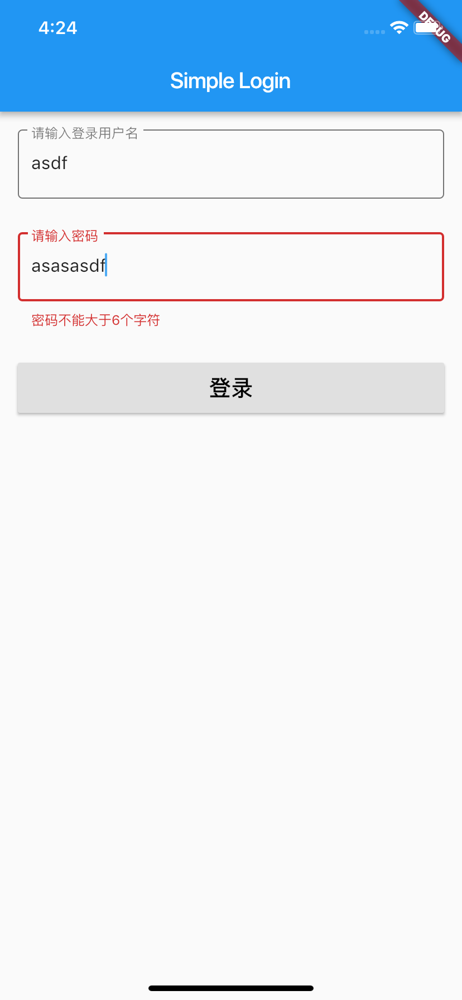

# flutter_demo

A new Flutter application.

# Dart 一切皆是Object

# Flutter 一切皆是Widget

## 效果图展示

     

## 1、基础组件，列出几个常见使用的组件

1. Container 需要注意 container中的color不能和组件中的decoration的color同时设置值，编译报错         
2. TextFormField 输入框的使用	      
3. Image 的4种加载图片的方法          
4. RichText 的使用
5. Button，RaisedButton，FlatButton
6. ListView: ListTile, List.generate, Listbuilder，Listview.PullToRefresh的功能
7. GridView.builder
8. GestureDetector 手势
9. PageView、PageController 滑动view的功能
10. Animation 动画

## 2、如何使用第三方库

1. 在项目根目录下pubspec.yaml的配置文件中的dependencies下添加，需要依赖的库,
例如：

		dependencies:
  			flutter:
    			sdk: flutter

  			# The following adds the Cupertino Icons font to your application.
  			# Use with the CupertinoIcons class for iOS style icons.
  			cupertino_icons: ^0.1.2
  			# 网络库
  			url_launcher: ^5.0.2
  			# 图片加载库
  			image_picker: ^0.5.0+9
  			fluttertoast: ^3.0.3

找库的地址：
[https://pub.dartlang.org/](https://pub.dartlang.org/)

例如：

然后在pubspec.yaml配置文件的的右上角点击“Packages get” 拉取下包，出现以下情况，即可完成拉取包。

## 3、如何使用GlobalKey，在表单中存储当前状态值，采用Map的key-value的形式缓存数据

	abstract class GlobalKey<T extends State<StatefulWidget>> extends Key
	
也是一个泛型类型，但是T必须要继承自State<StatefulWidget>，可以说这个GlobalKey专门用于组件了。
再看：

	static final Map<GlobalKey, Element> _registry = <GlobalKey, Element>{};
	
GlobalKey里含有一个Map，key和value分别为自身和Element。
代码分析：

## 4、加载网页

采用第三方网络库：url_launcher

例如：

	TextSpan(
      text: 'Github',
      style: TextStyle(color: Colors.blue),
      recognizer: TapGestureRecognizer()
        ..onTap = () async {
          String url = 'https://github.com/jiangqingbo/flutter_demo';
          if (await canLaunch(url)) {
            await launch(url);
          } else {
            throw 'error: $url';
          }
        }),
        
## 5、animation动画

1. 四种状态：

	>* dismissed：动画初始状态
	>* forward：动画从头到尾播放状态
	>* reverse：动画从尾到头播放状态
	>* completed：动画完成状态

2. Animation类是Flutter动画中核心的抽象类，它包含动画的当前值和状态两个属性。定义了动画的一系列监听回调。

	>* 值监听：addListener、removeListener
	>* 状态监听：addStatusListener、removeStatusListener   

3. AnimationController动画的控制。

	>* AnimationController是一个特殊的Animation对象，在屏幕刷新的每一帧，就会生成一个新的值，默认情况下，AnimationController在给定的时间段内会线性的生成从0.0到1.0的数字
	>* 属于Animation<double>类型
	>* 具有控制动画的方法，例如，.forward()方法可以启动动画
	>* 当创建一个AnimationController时，需要传递一个vsync参数，存在vsync时会防止屏幕外动画（动画的UI不在当前屏幕时）消耗不必要的资源。
	>* 通过将SingleTickerProviderStateMixin添加到类定义中，可以将stateful对象作为vsync的值。如果要使用自定义的State对象作为vsync时，请包含TickerProviderStateMixin。
	>* 特别注意：在不使用时需要调用dispose方法，否则会造成资源泄露

4. Curve

	>* 定义了时间和数值的抽象类。Flutter封装定义了一系列的插值器，如linear、decelerate、ease、bounce、cubic等。当然Flutter提供的不满足需求的话，也可以自定义插值器。

5. Tween 线性估值器。Flutter还封装定义了不同类型的估值器：

	>* ReverseTween
	>* ColorTween
	>* SizeTween
	>* RectTween
	>* IntTween
	>* StepTween
	>* ConstantTween